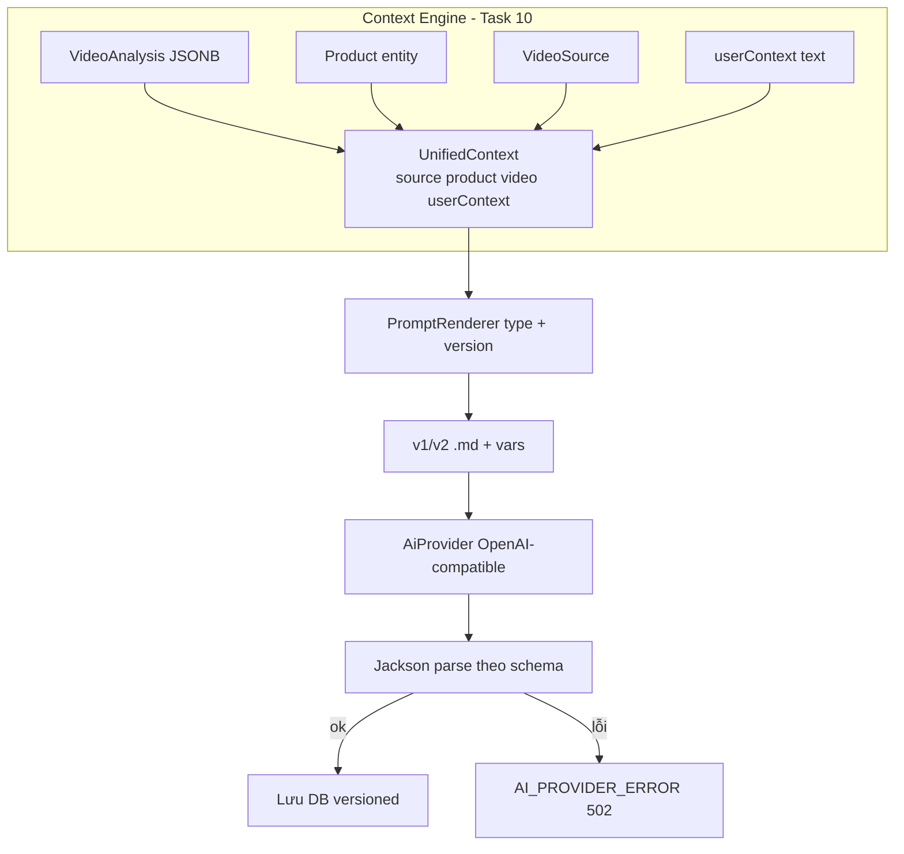

# AI Pipeline

## Provider & Prompt

- `AiProvider`: `generateText / generateStructured / analyzeImage / analyzeVideoContext`.
  Impl đầu tiên `OpenAiCompatibleProvider` (`{base}/chat/completions`, JSON mode cho structured).
  Đổi provider chỉ cần thêm class mới, không sửa service.
- Prompt nằm file `resources/prompts/{TYPE}_v{version}.md`, render `{{var}}`.
  Đổi version bằng env (`CONTENT_PROMPT_VERSION`, `ANALYSIS_PROMPT_VERSION`).
- `PromptType`: VIDEO_ANALYSIS, CONTENT_GENERATION, VOICE_SCRIPT, SCENE_GENERATION, CAPTION_GENERATION.
- v2 (mặc định content/caption): hook 3s đầu, scenes 15-30s, 3-5 hashtag (chuẩn TikTok).

## Env AI

| Biến | Dùng cho | Mặc định |
|---|---|---|
| `AI_BASE_URL` / `AI_API_KEY` / `AI_MODEL` | Task 09, 11 | openai.com / trống / gpt-4o-mini |
| `ELEVENLABS_API_KEY` / `ELEVENLABS_VOICE_ID` / `ELEVENLABS_MODEL` | Task 12 (giọng ADAM, tiếng Việt bắt buộc `eleven_v3`) | trống / Adam / eleven_v3 |

Thiếu key: app vẫn boot, gọi tới mới báo lỗi rõ (`AI_API_KEY` / `ELEVENLABS_API_KEY`).
STT hiện Noop (transcript rỗng); muốn transcript thật dùng ElevenLabs Scribe với cùng key TTS.
