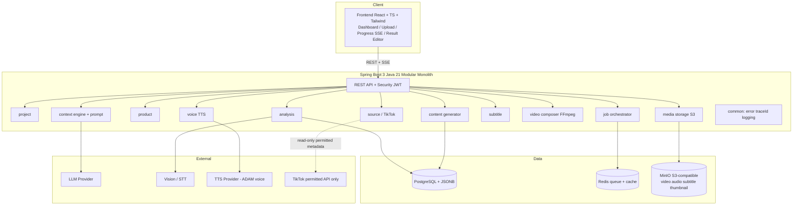
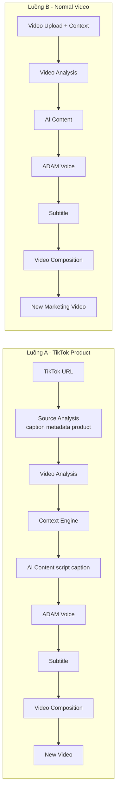
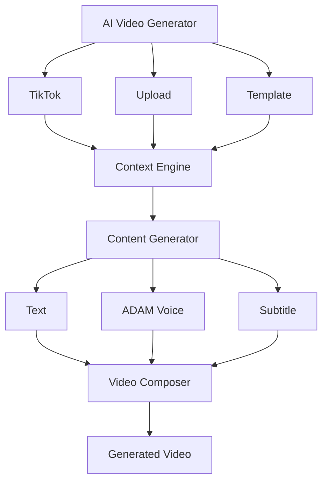
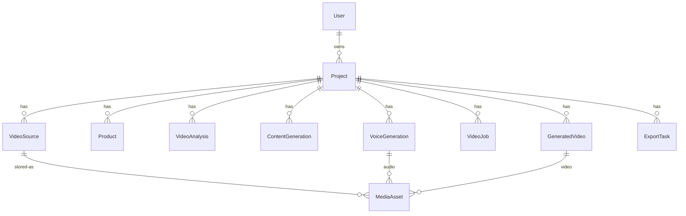
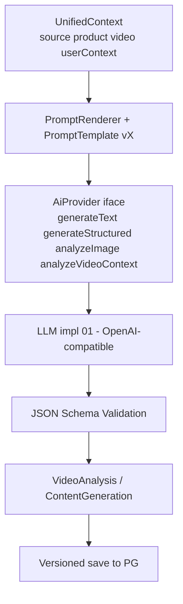
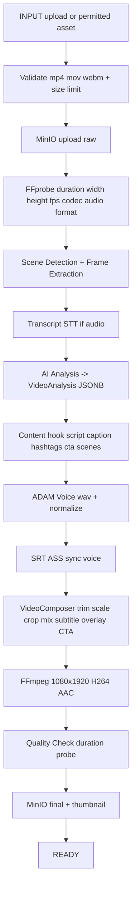
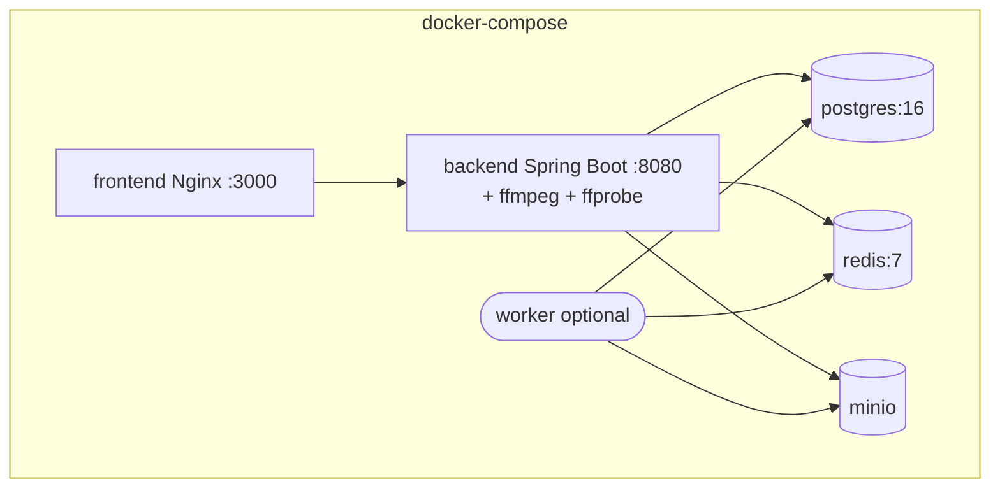

# Architecture — AI Video Content Generator

> Nguồn: `master.md` (30 sections). Tài liệu này là kiến trúc cuối cùng, đóng băng trước khi implement Task 02→18.
> Quy tắc: Không thay đổi architecture giữa chừng nếu chưa giải thích lý do (master.md §30).

---

## 1. Current Architecture (phân tích repo ngày 30/09/2026)

| Hạng mục | Kết quả kiểm tra |
|---|---|
| Cấu trúc project | Repo trống, chỉ có `master.md` (966 dòng). Chưa có `pom.xml`, `backend/`, `frontend/`, `docker-compose.yml` |
| Java / Spring Boot | Chưa có code. Máy local: **Java 21.0.9 LTS (Temurin), Maven 3.9.16** → đáp ứng yêu cầu Java 21 |
| Frontend | Chưa có. Máy local: **Node v26.0.0** → đủ để chạy React + TypeScript + Vite |
| Database | Chưa có. Chưa có entity, migration, Flyway. Docker có sẵn **v29.5.3** → sẽ chạy Postgres/Redis/MinIO bằng Compose |
| Docker | Chưa có `Dockerfile` / `docker-compose.yml` |
| Dependencies | Chưa có. Cần khởi tạo từ zero (xem §8) |

**Kết luận:** Đây là greenfield project. Không có code cũ để migrate. Mọi quyết định architecture dưới đây là đề xuất cuối cùng.

---

## 2. Proposed Architecture — Tổng quan

Hệ thống là **"AI repurpose engine"** (không phải tool reup): phân tích cấu trúc video được phép sử dụng + product context + user context → tạo phiên bản marketing mới (script, voice ADAM, subtitle, video 1080x1920).



Hai luồng hoàn chỉnh (sau 18 task):



Mở rộng tương lai (master.md gợi ý):



---

## 3. Component Architecture

| Component | Trách nhiệm | Giao tiếp |
|---|---|---|
| `auth/user` | JWT, roles USER/ADMIN, không log password/JWT/API key | Spring Security filter → `User` entity |
| `project` | CRUD Project (`TIKTOK_PRODUCT`, `NORMAL_VIDEO`), status | REST `/api/projects` |
| `source` | `SourceProvider` abstraction; `TikTokSourceProvider` chỉ dùng permitted API; trả `USER_UPLOAD_REQUIRED` khi không truy cập được; `VideoMetadataService` (FFprobe) | REST `/tiktok`, `/upload` |
| `product` | `ProductProvider` abstraction; `ProductContext` (name/category/desc/features/material/color/size/audience/sellingPoints/price/url); fallback nhập tay | DB `Product` |
| `analysis` | FFprobe → scene detect → frame extract → STT transcript → AI analyze → `VideoAnalysis` JSONB | Background Job |
| `content` + `context` | `ContextEngine` gộp source/product/video/user → `UnifiedContext`. AI chỉ nhận UnifiedContext. `PromptTemplate/Version/Renderer` | REST `/generate-content`, versioned |
| `voice` | `VoiceProvider` → `AdamVoiceProvider`; options voice/speed/pitch/emotion/lang/format; audio chuẩn hoá | REST `/generate-voice`, lưu MinIO |
| `video` + `export` | `SubtitleService` (SRT/ASS đồng bộ voice); `VideoComposer` build FFmpeg từ validated params (không nhận raw command từ FE); trim/scale/crop/mix/normalize; export 1080x1920 H264+AAC | REST `/generate-video`, `/result` |
| `job` | Trạng thái PENDING→PROCESSING→COMPLETED/FAILED/CANCELLED; steps ANALYZE→CONTENT→VOICE→SUBTITLE→VIDEO→EXPORT; progress 0-100, SSE `/status` | Redis queue / Spring Async |
| `media` | `MediaStorage` abstraction: upload/download/delete/exists/getUrl; impl MinIO; buckets video/audio/subtitle/thumbnail | S3-compatible |
| `common/config` | Error chuẩn `{code,message,details,traceId}`, traceId/projectId/jobId logging, validation, config env | Mọi module |

Luồng request chuẩn: `Controller → Service → Domain/Repository → Infrastructure`. Không viết business logic trong Controller. Không đưa Entity trực tiếp ra API (dùng DTO + validation).

---

## 4. Backend Package Structure

Build: Maven multi-module hoặc single-module với package chia module (ưu tiên single-module trước để đơn giản, tách worker sau):

```
backend/
├── pom.xml
├── src/main/java/com/aivideo/
│   ├── AivideoApplication.java
│   ├── auth/          # JwtFilter, AuthController, AuthService
│   ├── user/          # User entity, repository, service
│   ├── project/       # Project entity, DTO, Controller, Service
│   ├── source/        # VideoSource, SourceProvider, TikTokSourceProvider, VideoMetadataService, UploadController
│   ├── product/       # Product, ProductProvider, ProductAnalyzer
│   ├── analysis/      # VideoAnalysis (JSONB), AnalysisService, SceneDetector, FrameExtractor, SttService
│   ├── content/       # ContentGeneration (versioned), ContextEngine, PromptTemplate/Renderer, ContentService
│   ├── voice/         # VoiceProvider, AdamVoiceProvider, VoiceGeneration, VoiceService
│   ├── video/         # SubtitleService, VideoComposer, GeneratedVideo, VideoService
│   ├── media/         # MediaStorage iface, MinioStorage, MediaAsset
│   ├── job/           # VideoJob, ExportTask, JobService, JobOrchestrator, SSE controller
│   ├── export/        # ExportTask, DownloadController
│   ├── common/        # ApiError, GlobalExceptionHandler, TraceIdFilter
│   └── config/        # Security, Minio, Redis, Async, Jackson, FFmpeg props
├── src/main/resources/
│   ├── application.yml
│   ├── db/migration/  # Flyway V1__init.sql ...
│   └── prompts/       # VIDEO_ANALYSIS_v1.md, CONTENT_GENERATION_v1.md ...
└── src/test/java/com/aivideo/...
```

Frontend (tách repo folder):

```
frontend/
├── package.json (React + TS + Vite + Tailwind + axios + video player)
├── src/pages/   # Dashboard, Projects, CreateProject, ProjectDetail, ResultEditor
├── src/components/ # UploadProgress, JobProgress(SSE), VideoPreview
└── src/api/     # client cho /api/projects...
```

---

## 5. Database Overview (chi tiết đầy đủ ở `docs/database.md` — Task 02)

Entities: `User, Project, VideoSource, Product, VideoAnalysis, ContentGeneration, VoiceGeneration, VideoJob, MediaAsset, GeneratedVideo, ExportTask`.

Nguyên tắc:
- Không lưu video binary vào PostgreSQL — chỉ lưu `storageKey` → object storage.
- `VideoAnalysis.result` và `ContentGeneration.result` dùng **JSONB** + schema validation.
- `ContentGeneration` có `version` để regenerate; `VoiceGeneration` lưu voice options.
- Flyway migration, index trên `project_id`, `status`, `created_at`.
- ERD Mermaid sẽ nằm ở `docs/database.md` (Task 02).



---

## 6. AI Architecture

Abstraction bắt buộc (không hard-code provider, key từ env):



- `AiProvider`: `generateText()`, `generateStructured()`, `analyzeImage()`, `analyzeVideoContext()`.
- `PromptType`: VIDEO_ANALYSIS, CONTENT_GENERATION, VOICE_SCRIPT, SCENE_GENERATION, CAPTION_GENERATION. Prompt lưu file + version trong DB, không hard-code trong Controller.
- Structured output validate bằng schema (không parse string hack).
- STT/TTS/Vision cũng là abstraction riêng (`SttProvider`, `VoiceProvider`).

---

## 7. Video Processing Architecture



- `VideoMetadataService` gọi FFprobe, không nhận FFmpeg command từ frontend.
- `VideoComposer` xây command từ validated params (start/end, scale, overlay text, subtitle path, audio path).
- Mỗi bước cập nhật `VideoJob.currentStep + progress`; lỗi map sang `FFMPEG_ERROR / TTS_PROVIDER_ERROR / AI_PROVIDER_ERROR / STORAGE_ERROR` + retry/timeout.
- Binary (ffmpeg) đóng gói trong backend Docker image; worker optional tách riêng khi tải cao.

---

## 8. Deployment Architecture



Compose services: `postgres, redis, minio, backend, frontend`, optional `worker`. Mọi secret qua env (xem `.env.example` ở Task 18): `DB_URL, REDIS_URL, S3_ENDPOINT/KEY/SECRET/BUCKET, JWT_SECRET, AI_API_KEY, AI_MODEL, TTS_API_KEY, TTS_VOICE_ADAM_ID, MAX_UPLOAD_MB, FFMPEG_PATH`.

---

## 9. Quyết định kiến trúc then chốt (ADR rút gọn)

1. **Modular monolith trước, microservice sau** — đủ cho 2 luồng; worker tách khi cần scale FFmpeg/AI.
2. **PostgreSQL JSONB cho AI output** — linh hoạt schema + query được, thay vì EAV.
3. **MinIO S3-compatible** — local/dev và prod S3 không đổi code (`MediaStorage` iface).
4. **Redis queue + Spring Async, SSE cho status** — đơn giản hơn WebSocket; FE polling là fallback.
5. **Tuân thủ TikTok** — chỉ permitted metadata/API; `USER_UPLOAD_REQUIRED` + hướng dẫn upload asset có quyền; không bypass protection, không scrape trái phép.

---

## 10. Files sẽ tạo (tổng thể, chi tiết theo task ở `docs/plan.md`)

```
pom.xml / backend/... (Task 02-05)
docker-compose.yml, backend/Dockerfile, frontend/Dockerfile (Task 18)
docs/architecture.md (file này - Task 01)
docs/database.md + ERD (Task 02)
docs/api.md, docs/video-pipeline.md, docs/ai-pipeline.md,
docs/local-development.md, docs/deployment.md (Task 18)
frontend/ React app (Task 16-17)
```

## 11. Dependencies cần thêm (tổng thể)

Backend (Spring Boot 3.3.x, Java 21): `spring-boot-starter-web, validation, security, data-jpa, flyway-core, postgresql, redis/lettuce, springdoc-openapi, minio, jackson-databind, lombok (optional), junit/mockito/testcontainers`.
Media/AI: `ffmpeg/ffprobe` binary trong image; SDK LLM OpenAI-compatible + STT + TTS qua HTTP client (không hard-code key).
Frontend: `react, typescript, vite, tailwind, axios, @tanstack/react-query`.
Infra: `postgres:16, redis:7, minio`.
