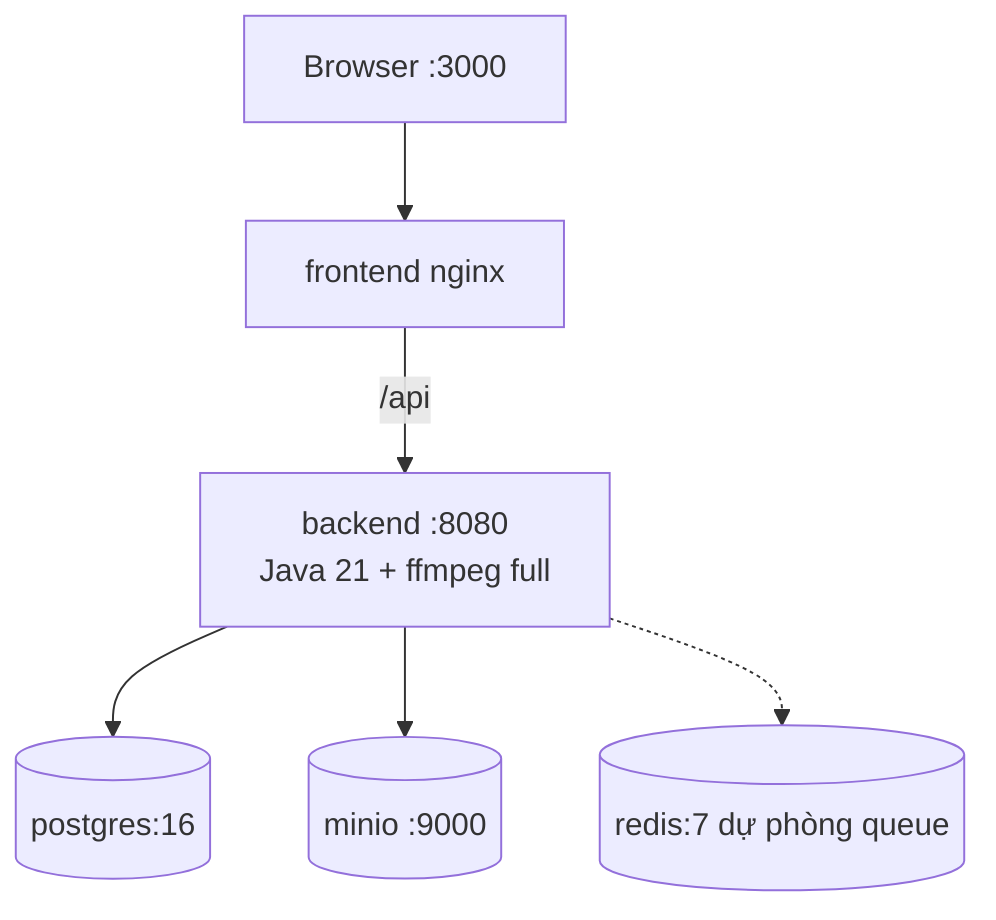

# Deployment



## Docker Compose

```bash
cp .env.example .env   # điền JWT_SECRET (>=32 ký tự), AI_API_KEY, ELEVENLABS_API_KEY
docker compose up --build -d
# frontend http://localhost:3000, backend http://localhost:8080, minio console :9001
docker compose logs -f backend
```

Services: `postgres` (volume pgdata, healthcheck), `redis` (dự phòng hàng đợi worker,
backend hiện chạy job in-process `@Async` — Redis sẽ dùng khi tách worker ở Task 18+),
`minio`, `backend` (image tự build: temurin:21 + `ffmpeg` + `fonts-dejavu`,
`VIDEO_FONT_PATH` đã trỏ DejaVu trong image), `frontend` (nginx proxy `/api` + SSE
unbuffered, `try_files` cho SPA routing).

## Lưu ý production

- Secret chỉ qua env (`.env` không commit). `JWT_SECRET` compose bắt buộc (`:?`).
- DB migrate bằng Flyway lúc boot (`ddl-auto: validate`, không `update`).
- Binary chỉ ở object storage; presigned URL hết hạn theo `S3_URL_EXPIRY_HOURS`.
- Giới hạn upload `MAX_UPLOAD_MB`; timeout AI/TTS/FFmpeg đã cấu hình.
- Chưa có: rate limit, Redis queue thật, retry job, cancel job, metrics — xem
  Known limitations trong README.
