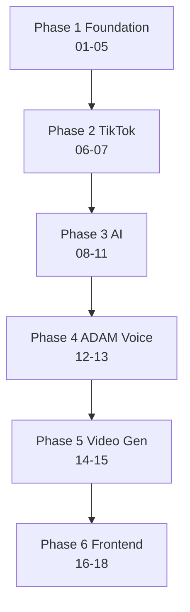

# Plan — 18 Tasks AI Video Content Generator

> Nguồn: `master.md` + message mô tả Task 01→18. Mỗi task tuân thủ Definition of Done (§30): compile, tests pass, API chạy, error handling, docs cập nhật, không TODO quan trọng.
> Report sau mỗi task: IMPLEMENTED / FILES_CHANGED / TESTS / HOW_TO_RUN / KNOWN_LIMITATIONS / NEXT_TASK.
> Thứ tự thực hiện: **01 → 02 → … → 18 tuần tự** (không làm frontend Task 16-17 trước khi pipeline backend Task 09-15 chạy được).

```mermaid
gantt
    title 18 Tasks Roadmap
    dateFormat X
    axisFormat %s
    section Phase 1 Foundation
    01 Architecture           :01, 1
    02 Database               :02, 2
    03 Project API            :03, 3
    04 Media Storage          :04, 4
    05 Upload + FFprobe       :05, 5
    section Phase 2 TikTok
    06 TikTok Analyzer        :06, 6
    07 Product Analyzer       :07, 7
    section Phase 3 AI
    08 AI Provider            :08, 8
    09 Video Analysis         :09, 9
    10 Context Engine         :10, 10
    11 Content Generator      :11, 11
    section Phase 4 Voice
    12 TTS ADAM               :12, 12
    13 Subtitle               :13, 13
    section Phase 5 Video
    14 FFmpeg Composition     :14, 14
    15 Generation Job         :15, 15
    section Phase 6 Frontend
    16 Dashboard              :16, 16
    17 Result Editor          :17, 17
    18 Hardening              :18, 18
```

---

## Tiến độ (làm xong task nào [X] task đấy)

- [X] TASK 01 — Phân tích project + Architecture
- [X] TASK 02 — Database Design
- [X] TASK 03 — Project Management API
- [X] TASK 04 — Media Storage Abstraction
- [X] TASK 05 — Video Upload + FFprobe Foundation
- [X] TASK 06 — TikTok Source Analyzer
- [X] TASK 07 — Product Context Analyzer
- [X] TASK 08 — AI Provider Abstraction
- [X] TASK 09 — Video Analysis Pipeline
- [X] TASK 10 — Unified Context Engine
- [X] TASK 11 — AI Content Generation
- [ ] TASK 12 — TTS (ADAM Voice)
- [ ] TASK 13 — Subtitle Generation
- [ ] TASK 14 — FFmpeg Composition
- [ ] TASK 15 — Background Video Generation + Status
- [ ] TASK 16 — Frontend Dashboard
- [ ] TASK 17 — Result Editor
- [ ] TASK 18 — Production Hardening

---

## Phase 1 — Foundation

### [X] TASK 01 — Phân tích project + Architecture
- **Mục tiêu:** Không code. Phân tích repo, chốt architecture cuối.
- **Kiểm tra:** cấu trúc project, Java/Spring version, frontend, database, Docker, dependencies.
- **Tạo:** `docs/architecture.md` (Component, Backend packages, DB overview, AI, Video processing, Deployment + Mermaid).
- **Verify:** file tồn tại, diagrams render được.
- **DoD:** Báo cáo Current / Proposed / Files sẽ tạo / Dependencies cần thêm.
- **Kết quả:** Repo trống (chỉ `master.md`); máy có Java 21.0.9, Maven 3.9.16, Docker 29.5.3, Node 26 → greenfield, khởi tạo từ zero.

### [X] TASK 02 — Database Design
- **Mục tiêu:** Thiết kế DB cho 10 entities: User, Project, VideoSource, Product, VideoAnalysis, ContentGeneration, VoiceGeneration, VideoJob, MediaAsset, GeneratedVideo, ExportTask.
- **Files:** `backend/.../user|project|source|product|analysis|content|voice|video|job|export/*.java` (Entity+Repository), `src/main/resources/db/migration/V1__init.sql`, `docs/database.md` + ERD Mermaid.
- **Implement:** JPA/Hibernate, Flyway, quan hệ (User 1-N Project 1-N …), index (`project_id,status,created_at`), JSONB cho analysis/content result. Không lưu video binary vào Postgres.
- **Test:** migration up/down trên Postgres local/Docker, repository test, constraint test.
- **Verify:** `mvn test`, `docker compose up postgres`, Flyway migrate thành công.

### TASK 03 — Project Management API
- **Mục tiêu:** CRUD Project: `POST /api/projects`, `GET /api/projects`, `GET /api/projects/{id}`, `DELETE /api/projects/{id}`.
- **Model:** `{id,name,workflowType,status,createdAt,updatedAt}`, workflowType `TIKTOK_PRODUCT|NORMAL_VIDEO`.
- **Files:** `project/{Project,ProjectController,ProjectService,ProjectRepository,ProjectDTO,CreateProjectRequest}` + `common/{ApiError,GlobalExceptionHandler}`.
- **Implement:** Controller→Service→Repository, DTO + Bean Validation, không expose Entity, exception chuẩn `{code,message,details,traceId}`.
- **Test:** MockMvc CRUD, validation, 404, error format.

### TASK 04 — Media Storage Abstraction
- **Mục tiêu:** `MediaStorage` iface: `upload/download/delete/exists/getUrl`, impl MinIO, config qua env. Hỗ trợ video/audio/subtitle/thumbnail. Không lưu binary vào Postgres.
- **Files:** `media/{MediaStorage,MinioStorage,MinioProperties,MediaAsset}`, `config/MinioConfig`, integration test với Testcontainers/MinIO.
- **Test:** upload/download/delete round-trip, presigned URL, bucket per-type.

### TASK 05 — Video Upload + FFprobe Foundation
- **Mục tiêu:** Upload API `POST /api/projects/{id}/upload` → FFprobe (duration,width,height,fps,codec,audio,format) → tạo `VideoSource`.
- **Validate:** mp4/mov/webm (extension+MIME), giới hạn size qua config `MAX_UPLOAD_MB`. Không nhận FFmpeg command từ frontend.
- **Files:** `source/{UploadController,VideoMetadataService,FfprobeService,VideoSource}`, `config/UploadProperties`.
- **Test:** upload hợp lệ/không hợp lệ, FFprobe parse, giới hạn size.

## Phase 2 — TikTok Workflow

### TASK 06 — TikTok Source Analyzer ⭐ trọng tâm
- **Mục tiêu:** `POST /api/projects/{id}/tiktok` body `{url,context}`. Validate URL TikTok.
- **Thiết kế:** `SourceProvider` iface; `TikTokSourceProvider`: resolve permitted metadata (title/caption/author/thumbnail/product info nếu API cho phép). Không bypass protection.
- **Fallback:** nếu không lấy được asset → `{status:"USER_UPLOAD_REQUIRED"}` + FE hướng dẫn upload video có quyền sử dụng.
- **Files:** `source/{SourceProvider,TikTokSourceProvider,TikTokUrlValidator,TikTokController}`.
- **Test:** URL valid/invalid, provider behavior mock, case USER_UPLOAD_REQUIRED.

### TASK 07 — Product Context Analyzer
- **Mục tiêu:** `ProductAnalyzer` từ product URL hoặc data → `ProductContext{name,category,description,features,material,color,size,targetAudience,sellingPoints,price,productUrl}`.
- **Thiết kế:** `ProductProvider` abstraction, không hard-code scraping. Nếu external không có dữ liệu → cho user nhập tay.
- **Files:** `product/{ProductProvider,ProductAnalyzer,Product,ProductService}`.
- **Test:** parse đầy đủ/thiếu field, fallback manual input.

## Phase 3 — AI

### TASK 08 — AI Provider Abstraction
- **Mục tiêu:** `AiProvider{generateText,generateStructured,analyzeImage,analyzeVideoContext}` + 1 impl đầu tiên. Key từ env, không hard-code. Structured output validate schema. `PromptTemplate/PromptRenderer` + versioning (`VIDEO_ANALYSIS,CONTENT_GENERATION,VOICE_SCRIPT,SCENE_GENERATION,CAPTION_GENERATION`).
- **Files:** `content/{AiProvider,OpenAiCompatibleProvider,AiProperties,PromptTemplate,PromptRenderer}`, `resources/prompts/*.md`.
- **Test:** mock provider, schema validation fail/pass, prompt render + version.

### TASK 09 — Video Analysis Pipeline
- **Mục tiêu:** Pipeline Video→FFprobe→SceneDetect→FrameExtract→Transcript(STT)→AI→`VideoAnalysis{duration,scenes,detectedText,transcript,hook,cta,tone,visualStyle,productDescription}` JSON structured, lưu DB, chạy background Job.
- **Files:** `analysis/{AnalysisService,SceneDetector,FrameExtractor,SttProvider,VideoAnalysis}`, `job/JobService`.
- **Test:** pipeline với video mẫu ngắn, JSON schema, job async.

### TASK 10 — Unified Context Engine
- **Mục tiêu:** `ContextEngine` input (VideoAnalysis,Product,source metadata,user context) → `UnifiedContext{source,product,video,userContext}`. AI Content Generator chỉ nhận UnifiedContext.
- **Files:** `content/{ContextEngine,UnifiedContext}` + unit tests gộp thiếu/đủ field.

### TASK 11 — AI Content Generation
- **Mục tiêu:** `POST /api/projects/{id}/generate-content` → `{hook,script,caption,hashtags,cta,scenes[{start,end,voiceText,overlayText,purpose}]}` structured JSON, versioned, cho phép regenerate.
- **Files:** `content/{ContentService,ContentGeneration,ContentController}`.
- **Test:** schema validation, regenerate tạo version mới, scene timeline hợp lệ.

## Phase 4 — ADAM Voice

### TASK 12 — TTS (ADAM Voice)
- **Mục tiêu:** `VoiceProvider` → `AdamVoiceProvider`; `POST /api/projects/{id}/generate-voice` input `{contentGenerationId,voice=ADAM,speed,pitch,emotion}` → `VoiceGeneration`, audio lưu MinIO. Không hard-code provider. Nếu ADAM là voice clone người thật → chỉ dùng khi có quyền/giấy phép hợp lệ.
- **Files:** `voice/{VoiceProvider,AdamVoiceProvider,VoiceService,VoiceController,VoiceGeneration}`.
- **Test:** mock TTS, options mapping, audio lưu storage.

### TASK 13 — Subtitle Generation
- **Mục tiêu:** Từ voice đã gen → SRT/ASS đồng bộ audio, lưu object storage. `SubtitleService`, test timestamp.
- **Files:** `video/{SubtitleService,SubtitleGenerator}`.
- **Test:** timestamp monotonic, sync với duration audio, parse SRT.

## Phase 5 — Video Generator

### TASK 14 — FFmpeg Composition
- **Mục tiêu:** `VideoComposer` input (source video,voice,subtitle,scene plan,overlay,CTA) → 1080x1920 MP4 H264+AAC. Steps: trim/scale/crop/mix voice/subtitle/overlay/normalize/export. Backend tự build command từ validated params, FE không gửi raw command.
- **Files:** `video/{VideoComposer,FfmpegService,GeneratedVideo,VideoController}`.
- **Test:** compose video mẫu ngắn, assert resolution/codec/duration, fail case (thiếu asset).

### TASK 15 — Background Video Generation + Status
- **Mục tiêu:** Job system PENDING/PROCESSING/COMPLETED/FAILED/CANCELLED; pipeline ANALYZE→CONTENT→VOICE→SUBTITLE→VIDEO→EXPORT. `GET /api/projects/{id}/status → {status,progress,currentStep,errorMessage}`. Ưu tiên SSE, fallback polling.
- **Files:** `job/{VideoJob,JobOrchestrator,JobController(SSE),ExportTask}`, `export/ExportService`.
- **Test:** chuyển trạng thái, progress 0→100, SSE stream, retry/timeout.

## Phase 6 — Frontend + Hardening

### TASK 16 — Frontend Dashboard
- **Mục tiêu:** Dashboard/Projects/Create/ProjectDetail/GeneratedVideo. Create có 2 nút [TikTok Product Video][Normal Video]. TikTok flow (URL+product URL+context), Normal flow (upload+context+voice=ADAM), upload progress + job progress. Ưu tiên functional, không cầu kỳ.
- **Files:** `frontend/src/pages|components|api/*`, `frontend/Dockerfile`.
- **Test:** `npm run build`, form validation, upload progress.

### TASK 17 — Result Editor
- **Mục tiêu:** Trang result: Video Preview + Hook/Script/Caption/Hashtags/CTA; buttons Edit/Regenerate Content/Voice/Video/Download. Cho sửa script trước khi gen voice, sửa caption/hashtags.
- **Files:** `frontend/src/pages/ResultEditor*`.
- **Test:** edit→regenerate flow E2E thủ công.

### TASK 18 — Production Hardening
- **Mục tiêu:** Review security (JWT USER/ADMIN, validate file/URL/MIME, chặn raw FFmpeg, env cho key, không expose storage creds), error/traceId/logging (START_JOB…JOB_FAILED, không log key/JWT/pass), index DB, Redis retry, timeout FFmpeg/AI/TTS. Docker Compose (postgres/redis/minio/backend/frontend + optional worker), env, README, API docs (springdoc).
- **Files:** `docker-compose.yml`, `*/Dockerfile`, `.env.example`, `README.md`, `docs/{api,video-pipeline,ai-pipeline,local-development,deployment}.md`.
- **Verify:** `mvn test`, `npm test/build`, `docker compose up`, E2E: Upload→Analysis→Content→ADAM→Subtitle→Video→Download (cả 2 luồng A/B).

---

## Phụ lục: Hai luồng hoàn chỉnh sau 18 task

```mermaid
flowchart TB
    subgraph LuongA [Luồng A - TikTok]
        A1[TikTok URL] --> A2[Source Analysis caption metadata product]
        A2 --> A3[Video Analysis]
        A3 --> A4[Context Engine]
        A4 --> A5[AI Content]
        A5 --> A6A[Script] & A6B[Caption]
        A6A --> A7[ADAM Voice]
        A7 --> A8[Subtitle]
        A8 --> A9[Composition]
        A9 --> A10[New Video]
    end
    subgraph LuongB [Luồng B - Normal]
        B1[Upload + Context] --> B3[Video Analysis]
        B3 --> B4[AI Content]
        B4 --> B6[ADAM Voice]
        B6 --> B7[Subtitle]
        B7 --> B8[Composition]
        B8 --> B9[New Marketing Video]
    end
```

> Triết lý sản phẩm: **"AI repurpose engine"** — phân tích cấu trúc video được phép dùng + product context → tạo phiên bản marketing mới, dễ mở rộng TikTok/Upload/Template → Context Engine → Content → Text/ADAM/Subtitle → Composer.
