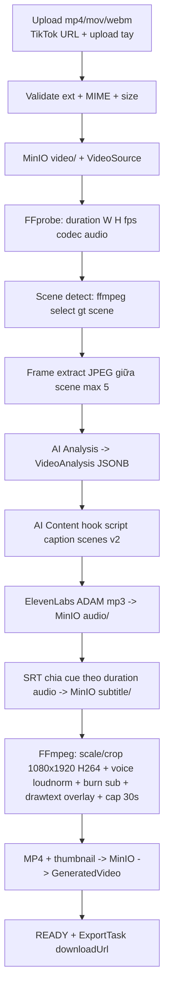
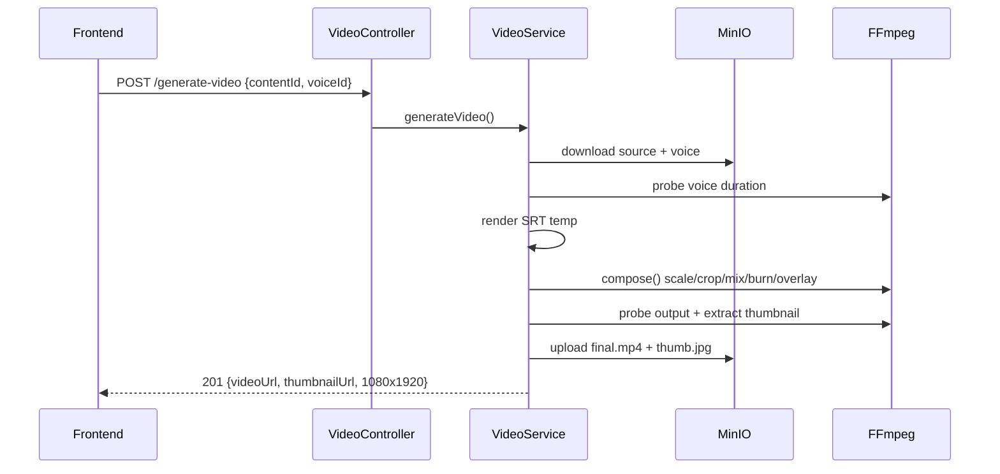

# Video Pipeline

## Chuẩn output (TikTok 9:16)

- 1080x1920, H.264 (`yuv420p`, CRF 23, 30fps) + AAC 128k/44.1kHz stereo, `.mp4`.
- Voice thay hoàn toàn audio gốc (`-map 1:a`), chuẩn hóa `loudnorm`.
- Source ngắn hơn voice thì loop (`-stream_loop`); dài hơn voice thì `-shortest`; cứng tối đa 30s.
- Subtitle burn bằng libass; overlay text từng scene bằng drawtext (escape `%` -> `\\%`).
- Yêu cầu ffmpeg **full** (libass + freetype) + font chữ (`VIDEO_FONT_PATH`).

## Sequence generate-video

